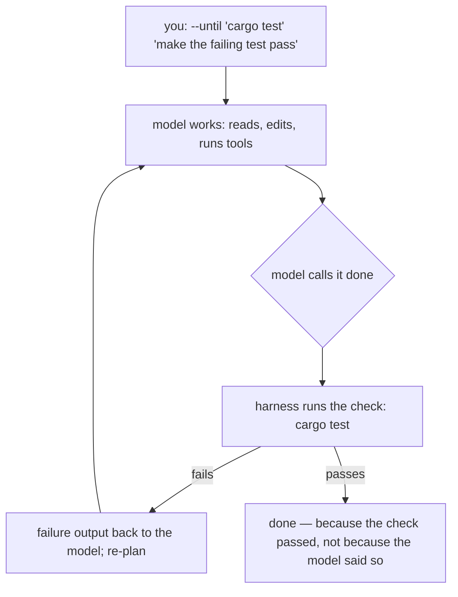

+++
title = "Worksmith"
description = "A terminal coding agent for small, cheap, or local models. The harness does the work of keeping a weaker model honest — it will not call a task done until a check you named passes."
+++

Worksmith is a terminal coding agent for people running small, cheap, or local
models. Codex, Gemini CLI, and pi are thin wrappers around a frontier model
that mostly stays on task. Worksmith bets the other way: **the harness does the
work of keeping a weaker model honest.** It keeps the model on task, notices
when it spins, and refuses to call a task done until a check you named actually
passes. When the model says "I'm finished," the harness runs the check — and if
the check fails, it sends the model back with the failure output.

```sh
worksmith --until "cargo test" "make the failing test pass"
```

The model stops when the test passes, not when it says so.

## Is this for you?

Probably yes if you run models locally (vLLM, llama.cpp, Ollama) or on cheap
hosted endpoints; if you want work gated on a real check instead of a model's
self-assessment; if you live in a terminal; or if you want to hand background
work to several agents at once without babysitting each.

Probably not if you drive a frontier model that already checks its own work —
the eval below found the loop is dead weight there, spending tokens for no
gain. Also not if you want IDE integration, a GUI, or a hosted service.
Worksmith is one Rust binary that talks to any OpenAI-compatible endpoint, and
nothing else.

## The bet, measured

Both numbers come from [`evals/README.md`](../../evals/README.md), over the same
seven tasks, each run raw (the model stops when it decides it is done) and
guided (the validation-driven loop re-plans until the check passes).

**Worth +34 points on a small model.** qwen3.5-9b went from 52% to 86% (11/21
to 18/21) with validation on, at flat cost per solved task — 640 generated
tokens before, 658 after. The detail that matters more than the headline:
**all ten of the unguided failures had outcome `done`.** Not stuck, not out of
steps. The model declared itself finished and was wrong. That is the thesis as
data: "I'm done" is a proposal; the check is the gate.

**On a capable 27B it changed nothing.** 21/21 either way, for about 18% more
tokens. On this suite the 27B self-loops and self-checks, so the loop only
forces what it already does, and the extra tokens are pure overhead.

That narrows the pitch on purpose. Guidance turns confidently-wrong into
correct. It cannot manufacture capability a model lacks, and above some line it
is pure overhead. This earns its keep when the model is weak enough to need it.

## How the loop works

Everything hangs off one loop — and one bus. The turn runs two loops nested
inside each other.

```
 run_turn ─────────────────────────────────────────────┐
   │  snapshot the model once                          │  outer loop:
   │  reset per-turn budgets                           │  retries after a
   ▼                                                   │  failed validation
 run_until_idle ──────────────────────────────┐        │
   │                                          │        │
   │  ┌─────────────────────────────────┐     │ inner  │
   │  │ 1. compact if over 75% of ctx   │     │ loop:  │
   │  │ 2. build the request            │     │ one    │
   │  │ 3. call_model (streams to bus)  │     │ step   │
   │  │ 4. no tool calls? → idle        │     │ per    │
   │  │ 5. run each tool, append result │     │ pass   │
   │  │ 6. stuck? → nudge               │     │        │
   │  └──────────────┬──────────────────┘     │        │
   │                 └── loop, max_steps ─────┘        │
   ▼                                                   │
 IdleReason: ModelDone | Stuck | Blocked | MaxSteps
   │                                                   │
   ▼                                                   │
 validate (--until) ── fails ──► re-plan, retries_left─┘
   │ passes
   ▼
 TurnComplete
```

**Inner** = "keep going until the model stops calling tools." It streams a
completion, runs each tool call, feeds the results back, and repeats — with
compaction when context grows past 75% and a nudge when the model repeats the
same call with no progress. **Outer** = "the model saying done is not evidence
it is done." That is the harness's differentiator, and it is what `--until`
turns on.

When the model declares itself finished, the outer loop does not accept the
claim. It runs the check you named:



The re-plans are bounded (`[agent] max-retries`, default `3`), so a model that
cannot make the check pass stops with a clear `validation failed` outcome
instead of spinning forever. If it keeps repeating the same tool call, it is
nudged rather than left to spin (`[agent] stuck-threshold`, default `3`).

## What it actually is

One Rust binary, zero runtime, that talks to any OpenAI-compatible endpoint —
OpenRouter, RunPod, a local vLLM, or anything else that speaks the API. The
model is `provider/model` in a TOML config; the harness is the loop, the event
stream, the session file, and the checks.

Four ways to drive it, all sharing the same loop and the same session:

```sh
worksmith                                  # full-screen TUI
worksmith --print "summarize src/main.rs"  # one-shot, pipe-friendly
worksmith --mode json "list the rust files" # machine-readable event stream
worksmith --plain                          # line REPL instead of the TUI
```

`--mode json` is the one that makes the docs interactive: it is the typed event
stream the Session Player replays, and it is what the evals capture.

It also fans work out. One `/spawn` becomes N workers on a cheap model, with
the session's model judging what comes back. That exact shape — three drafters
on a cheap model, a strong model picking one — produced three complete
newsletters and a reasoned decision, all passing a written rubric, for about
$0.05. And a project's own `.worksmith/config.toml` is not applied until you
trust it, because it can run shell commands unattended.

## Get started

The [quickstart](quickstart.md) takes you from nothing installed to a first
`--until` run: install, point it at a model with a `zola.toml`-style config,
and a task gated on a real check. The [guide](guide/) explains the machinery —
start with the [validation loop](guide/validation-loop.md), the page everything
else hangs off.
