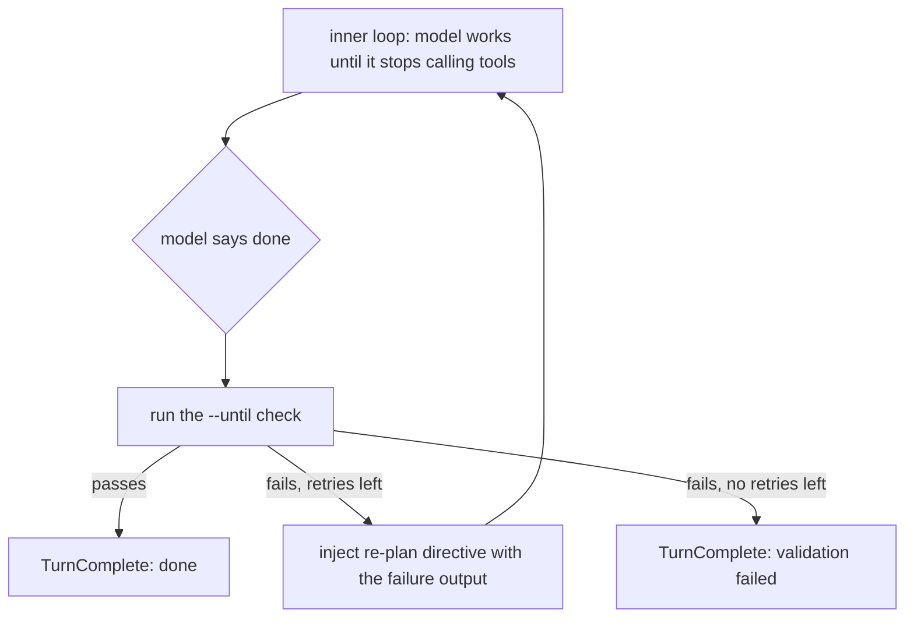

+++
title = "The validation loop"
description = "Set a completion check, understand retries, and interpret the result."
weight = 10
+++

With `--until` or `/validate`, Worksmith runs a check before accepting a task
as complete. Failed checks return their output to the model for another attempt.
Without a configured check, `done` means the model finished; it does not mean
Worksmith independently verified the result.

## Why the loop exists

A model can stop while its work still contains errors. A test command gives
Worksmith an observable result to use when deciding whether to retry:

```
 model stops calling tools
        │
        ▼
   "I'm done"            ← a proposal, not evidence
        │
        ▼
   ┌──────────────────┐
   │ run the check    │    --until "cargo test"
   │ (does it exit 0?)│
   └────────┬─────────┘
            │
      ┌─────┴─────┐
      │           │
   passes      fails
      │           │
      ▼           ▼
   TurnDone   re-plan with the
              failure output,
              bounded retries
```

The model's judgment is a proposal; the check is the gate. When the check
fails, the harness does not accept the claim. It feeds the failure back as a
re-plan directive — "the check did not pass: … revise your approach and fix
the underlying problem, then finish" — and runs the inner loop again. That is
the whole product.

## What "done" means

A turn's outcome describes why it stopped:

- **`done`** — the model finished and any configured check passed. Without a
  check, this is an unvalidated completion. A passing check covers only what
  that command tests; review the changes as well.
- **`validation failed`** — the check still failed after the retry budget was
  exhausted.
- **`stuck`** — repeated tool calls or another progress failure persisted
  after intervention.
- **`blocked`** — a command matched the hard-refusal safety policy. An ordinary
  approval denial returns an error to the model so it can try another approach.
- **`hit step limit` / `aborted`** — the step budget was exhausted or the turn
  was cancelled.

Use `/stats` to inspect the recorded validation result. A bare `done` label is
not proof that a check ran.

Shell checks and the Bash tool use `pipefail`: a failing stage in a pipeline
makes the pipeline fail even if its final command succeeds. For example,
`cargo test | tee test.log` preserves a test failure. An explicit `|| true` still
masks failure, and consumers such as `head` can cause an upstream SIGPIPE by
closing a pipe early.

## How a failure becomes a re-plan

The turn is two loops nested inside each other. The **inner** loop keeps going
until the model stops calling tools (or gets stuck, or hits the step cap). The
**outer** loop is the validation gate: when the inner loop reports the model is
done, the outer loop runs the check, and on a failure it re-plans and runs the
inner loop again — up to a bounded number of retries.



The re-plans are bounded by `[agent] max-retries` (default `3`), so a model
that cannot make the check pass stops with a clear `validation failed` outcome
instead of spinning forever. The inner loop has its own guard: if the model
repeats the same tool call with no progress, it is nudged rather than left to
spin (`[agent] stuck-threshold`, default `3`).

## The measurements that bound the claim

Both numbers come from [`evals/README.md`](https://github.com/bradleyd/worksmith/blob/main/evals/README.md), over the
same seven tasks, each run raw (the model stops when it decides it is done) and
guided (the validation-driven loop re-plans until the check passes).

**Decisive on a weak model.** On qwen3.5-9b, guidance took the pass rate from
52% to 86% — 11/21 to 18/21, **+34 points** — at flat cost per solved task
(640 generated tokens before, 658 after). The detail that matters more than the
headline: **all ten failures among the 21 unguided attempts had outcome `done`.** Not stuck,
not out of steps. The model declared itself finished and was wrong. That is the
thesis as data: the loop did not add information, it added *enforcement* — it
caught the "I'm done" that was not.

**Dead weight on a capable model.** On a capable 27B (qwen3.8-27b), the same
suite recorded 21/21 raw successes. The evaluation notes describe the guided
result as effectively 21/21 after excluding a loss attributed to a since-fixed
truncation bug; that is a qualified result, not a clean 21/21 rerun. Guidance
used about 18% more tokens. On this suite the 27B self-loops and self-checks, so the loop
only forces what it already does, and the extra tokens are pure overhead.

Taken together, the two runs give the shape of the differentiator: **dead
weight on a capable model, decisive on a weak one, at flat cost per unit of
delivered work.**

## The limit, stated plainly

Retries can correct some failures, but success is not guaranteed. In the 9B
run, one task — `docx-styling` — passed
0/3 in **both** modes, with the guided run burning 6× the tokens iterating. The
loop made a wrong answer correct where the model could get there; it could not
resolve that task within the tested setup and budget.

That is why the pitch is narrowed on purpose, and why the docs say so out loud.
This earns its keep when the model is weak enough to need it — which is exactly
the small, cheap, and local models this tool is for.
