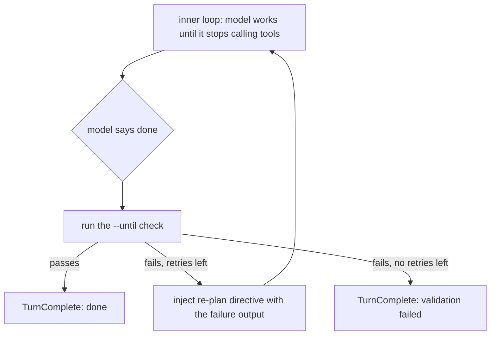

+++
title = "The validation loop"
description = "Why the loop exists, what 'done' means, and the two measurements that bound the claim: decisive on a weak model, dead weight on a capable one."
weight = 10
+++

The other terminal agents treat a model's "I'm finished" as the end of the
turn. Worksmith treats it as a *proposal*. The turn is not done when the model
says it is done; it is done when a check you named exits `0`. That single
decision — validate instead of trust — is what the whole harness exists to
enforce, and this page is the one everything else hangs off.

## Why the loop exists

A small model will tell you it is finished while it is still wrong. It is not
lying; it has no reliable sense of whether its own output is correct, so it
reports the task complete the moment it stops calling tools. The failure is not
malice or a bug in one model — it is the shape of a model that cannot check
itself.

The fix is not a better prompt. It is to move the question out of the model
entirely:

```
 model stops calling tools
        │
        ▼
   "I'm done"            ← a proposal, not evidence
        │
        ▼
   ┌──────────────────┐
   │ run the check    │    --until "cargo test"
   │ (does it exit 0?)│
   └────────┬─────────┘
            │
      ┌─────┴─────┐
      │           │
   passes      fails
      │           │
      ▼           ▼
   TurnDone   re-plan with the
              failure output,
              bounded retries
```

The model's judgment is a proposal; the check is the gate. When the check
fails, the harness does not accept the claim. It feeds the failure back as a
re-plan directive — "the check did not pass: … revise your approach and fix
the underlying problem, then finish" — and runs the inner loop again. That is
the whole product.

## What "done" means

"Done" is a property of the *check*, not of the model's confidence. There are
several ways a turn can end, and only one of them means the work is verified:

- **`done`** — the model stopped calling tools *and* the `--until` check passed.
  This is the only outcome that means "it works."
- **`validation failed`** — the model stopped, but the check did not pass and
  the re-plans are exhausted. The work is *not* done; the harness says so
  instead of letting a confident "finished" stand.
- **`stuck`** — the model kept repeating the same tool call with no progress.
  It is nudged first; if it keeps going, the turn ends as stuck rather than
  reporting a silent success.
- **`blocked` / `hit step limit` / `aborted`** — the turn stopped for a reason
  other than the model finishing (a tool was refused, the step cap was hit, or
  you cancelled).

The contrast that matters is the first two. Without `--until`, a turn that
ends "finished" is `done` by the model's own say-so — and on a weak model that
is often wrong. With `--until`, "finished" only becomes `done` if the check
agrees.

## How a failure becomes a re-plan

The turn is two loops nested inside each other. The **inner** loop keeps going
until the model stops calling tools (or gets stuck, or hits the step cap). The
**outer** loop is the validation gate: when the inner loop reports the model is
done, the outer loop runs the check, and on a failure it re-plans and runs the
inner loop again — up to a bounded number of retries.



The re-plans are bounded by `[agent] max-retries` (default `3`), so a model
that cannot make the check pass stops with a clear `validation failed` outcome
instead of spinning forever. The inner loop has its own guard: if the model
repeats the same tool call with no progress, it is nudged rather than left to
spin (`[agent] stuck-threshold`, default `3`).

## The measurements that bound the claim

Both numbers come from [`evals/README.md`](../../../evals/README.md), over the
same seven tasks, each run raw (the model stops when it decides it is done) and
guided (the validation-driven loop re-plans until the check passes).

**Decisive on a weak model.** On qwen3.5-9b, guidance took the pass rate from
52% to 86% — 11/21 to 18/21, **+34 points** — at flat cost per solved task
(640 generated tokens before, 658 after). The detail that matters more than the
headline: **all ten of the 21 unguided failures had outcome `done`.** Not stuck,
not out of steps. The model declared itself finished and was wrong. That is the
thesis as data: the loop did not add information, it added *enforcement* — it
caught the "I'm done" that was not.

**Dead weight on a capable model.** On a capable 27B (qwen3.8-27b), the same
suite passed 21/21 *either way*, and guidance cost about 18% more tokens for no
pass-rate gain. On this suite the 27B self-loops and self-checks, so the loop
only forces what it already does, and the extra tokens are pure overhead.

Taken together, the two runs give the shape of the differentiator: **dead
weight on a capable model, decisive on a weak one, at flat cost per unit of
delivered work.**

## The limit, stated plainly

Guidance turns *confidently wrong* into *correct*. It cannot manufacture
capability a model lacks. In the 9B run, one task — `docx-styling` — failed
0/3 in **both** modes, with the guided run burning 6× the tokens iterating. The
loop made a wrong answer correct where the model could get there; it could not
make an impossible task possible.

That is why the pitch is narrowed on purpose, and why the docs say so out loud.
This earns its keep when the model is weak enough to need it — which is exactly
the small, cheap, and local models this tool is for.
