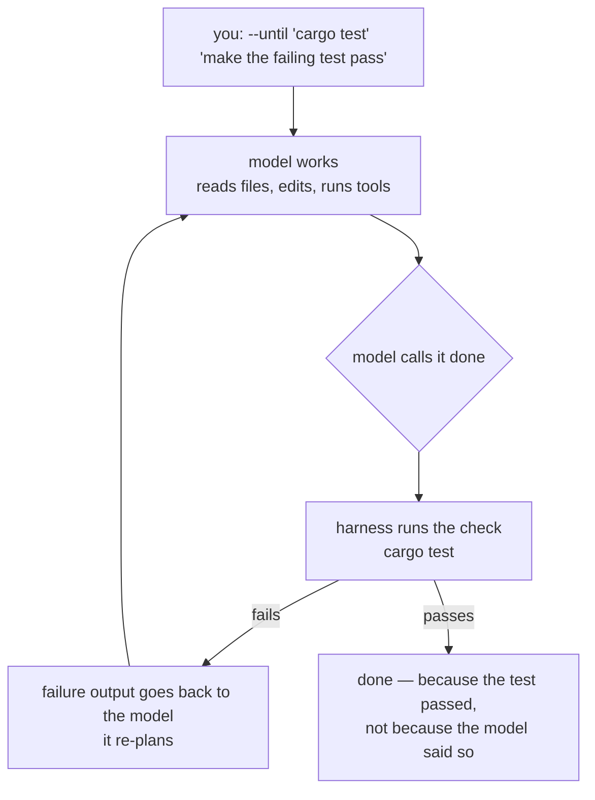

+++
title = "Quickstart"
description = "Install worksmith, point it at a model, and run your first task gated on a real check."
weight = 10
+++

Worksmith is a terminal coding agent for people running small, cheap, or local
models. It is not a thin wrapper around a frontier model that mostly stays on
task. The bet is the other way: **the harness does the work of keeping a weaker
model honest.** It will not call a task done until a check you named actually
passes. When the model spins, it notices, and sends it back with the failure
output instead of accepting "I'm finished."

This page gets you from nothing installed to a first run that is gated on a
real check. You need a terminal, a model behind any OpenAI-compatible endpoint
(local or hosted), and a few minutes.

## Install

Pick one way to install and stick to it.

**Homebrew** (macOS, no Rust toolchain needed):

```sh
brew tap bradleyd/worksmith
brew install bradleyd/worksmith/worksmith
```

**Prebuilt binary:** grab the latest `worksmith-<version>-<target>.tar.gz` from
the [releases](https://github.com/bradleyd/worksmith/releases), untar it, and
put `worksmith` on your PATH.

**From source** (needs a Rust toolchain):

```sh
git clone https://github.com/bradleyd/worksmith
cd worksmith
./install.sh          # release build → ~/.local/bin (on PATH)
# ./install.sh --debug for a faster dev build
```

One trap worth naming up front: `install.sh` writes to `~/.local/bin` and
`cargo install --path .` writes to `~/.cargo/bin`. If both exist, whichever
comes first on your PATH wins, and you can spend a while debugging a bug you
already fixed. `which -a worksmith` shows the duplicates.

```sh
worksmith --version
```

## Point it at a model

Run it once with no configuration. It creates `~/.worksmith/` and leaves an
annotated `config.example.toml` there. If it starts unconfigured, it prints both
paths — the directory and the example — so you know where to look.

```
  run worksmith (no config yet)
        │
        ▼
  creates ~/.worksmith/
  writes config.example.toml        ← annotated starter
        │
        │  you copy it, then edit two things
        ▼
  ~/.worksmith/config.toml          ← model + one [providers.*] section
        │
        ▼
  worksmith --until "cargo test" "make the failing test pass"
```

Copy the example to `config.toml` and set two things: `model`, and the
`[providers.<name>]` section that serves it. For a hosted first run, there is
one shortcut: `--model openrouter/...` and `--model openai/...` use built-in
provider defaults, so an empty `WORKSMITH_HOME` is enough when the matching API
key env var is exported.

```sh
cp ~/.worksmith/config.example.toml ~/.worksmith/config.toml
```

The whole file you need to start looks like this. One model, one provider:

```toml
# ~/.worksmith/config.toml

# "provider/model", or a bare name when exactly one provider is configured.
model = "openrouter/qwen/qwen3.8-27b"

# Keep this generous. It has to cover reasoning *and* output, and a whole-file
# write rides in a tool call's arguments, so a low cap truncates the call.
max-tokens = 8192

[providers.openrouter]
type = "openai-compat"
base-url = "https://openrouter.ai/api/v1"
api-key-env = "OPENROUTER_API_KEY"   # the env var holding your key
```

Then export the key that section names:

```sh
export OPENROUTER_API_KEY=...
```

That is the minimum. `type` is `openai-compat`, the only kind today, and you can
leave it off. `base-url` is required. `api-key-env` names the environment
variable that holds the key — omit it entirely for a server that needs no key,
and a named-but-unset variable warns rather than fails.

**Prefer a local model?** That is who this is really for. Point the provider at
your server and use a bare local model name. Start the server with tool-calling
on, or the agent has no hands:

```sh
vllm serve Qwen/Qwen3.5-9B --enable-auto-tool-choice \
  --tool-call-parser hermes --enable-prefix-caching
```

```toml
model = "vllm/Qwen/Qwen3.5-9B"

[providers.vllm]
type = "openai-compat"
base-url = "http://localhost:8000/v1"
# no api-key-env — a local server needs no key
```

When in doubt about what a local server accepts, ask it. Most are
FastAPI-based and publish their request schema, which settles the question
better than guessing a field and watching what happens:

```sh
curl -s http://127.0.0.1:8000/openapi.json \
  | python3 -c "import json,sys; \
    print(*json.load(sys.stdin)['components']['schemas']['ChatCompletionRequest']['properties'])"
```

## A first `--until` run

Now the point of the thing. Run it inside a repository that has a failing test,
and name the check that has to pass for the task to count as done:

```sh
worksmith --until "cargo test" "make the failing test pass"
```

`--until` takes a shell command that must exit `0`. The model stops when the
test passes, not when it says it is finished. That is the whole difference
between a harness that trusts a model and one that checks it.

Here is what happens between you pressing Enter and the "done" you can trust:



The model saying it is done is a *proposal*. The check is the gate. If `cargo
test` fails, the harness does not accept the claim; it feeds the failure back
and asks the model to revise its approach, up to a bounded number of re-plans
(`[agent] max-retries`, default `3`). If the model keeps repeating the same
tool call with no progress, it is nudged rather than left to spin
(`[agent] stuck-threshold`, default `3`).

The same command is the shape of the eval that measures the bet: on a small
model, gating on a check took a run from 52% to 86% at flat cost, and every
unguided failure had outcome `done` — the model declared itself finished and
was wrong.

## Where to go from here

A few things you will reach for right away:

```sh
worksmith                                  # full-screen TUI; /help lists the commands
worksmith --print "summarize src/main.rs"  # one-shot, pipe-friendly
worksmith --mode json "list the rust files" # machine-readable event stream
worksmith --plain                          # line REPL instead of the TUI
```

In the TUI, `Esc` or `jj` switches to reading the transcript, where `/` searches
and `y` yanks; `Ctrl+C` quits. To stop a model from spending its whole token
budget deliberating and returning nothing, add `--fast`. The configuration
reference in `config.example.toml` (the annotated version, written to
`~/.worksmith/` on first run) covers the rest — per-model context and prices,
spawned workers, and the `[agent]` loop knobs you just met.
